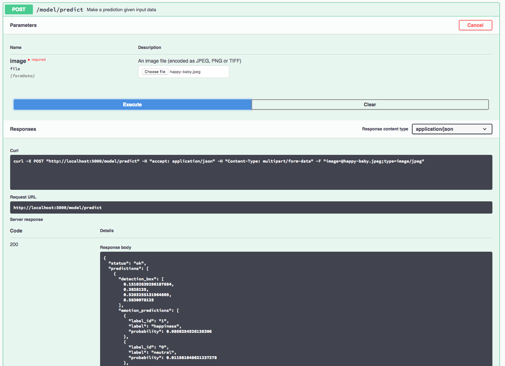

[](https://travis-ci.org/IBM/MAX-Facial-Emotion-Classifier) [](http://max-facial-emotion-classifier.max.us-south.containers.appdomain.cloud/)

# IBM Developer Model Asset Exchange: Facial Emotion Classifier

This repository contains code to instantiate and deploy a facial emotion classifier. The model first detects faces in an input image. Then, each face is passed to the emotion classification model which predicts the emotional state of the human, from a set of 8 emotion classes: `neutral`, `happiness`, `surprise`, `sadness`, `anger`, `disgust`, `fear`, `contempt`. The output of the model is a set of bounding box coordinates and predicted probabilities for each of the emotion classes, for each face detected in the image. The format of the bounding box coordinates is `[ymin, xmin, ymax, xmax]`, where each coordinate is _normalized_ by the appropriate image dimension (height for `y` or width for `x`). Each coordinate is therefore in the range `[0, 1]`.


The model is based on the [Emotion FER+ ONNX Model Repo](https://github.com/onnx/models/tree/master/emotion_ferplus). The model files are hosted on
[IBM Cloud Object Storage](https://s3.us-south.cloud-object-storage.appdomain.cloud/max-assets-prod/max-facial-emotion-classifier/1.0.0/assets.tar.gz).
The code in this repository deploys the model as a web service in a Docker container. This repository was developed
as part of the [IBM Developer Model Asset Exchange](https://developer.ibm.com/exchanges/models/).

## Model Metadata
| Domain | Application | Industry  | Framework | Training Data | Input Data Format |
| ------------- | --------  | -------- | --------- | --------- | -------------- |
| Vision | Facial Recognition | General | ONNX | [FER+ Emotion Dataset](https://www.kaggle.com/c/challenges-in-representation-learning-facial-expression-recognition-challenge/data) | Image (JPG/PNG) |

## References

* _E. Barsoum, C Zhang, C. Canton Ferrer, Z. Zhang_, ["Training Deep Networks for Facial Expression Recognition with Crowd-Sourced Label Distribution"](https://arxiv.org/abs/1608.01041), ACM International Conference on Multimodal Interaction (ICMI), 2016.
* [Emotion FER+ ONNX Model Repo](https://github.com/onnx/models/tree/master/emotion_ferplus)

## Licenses

| Component | License | Link  |
| ------------- | --------  | -------- |
| This repository | [Apache 2.0](https://www.apache.org/licenses/LICENSE-2.0) | [LICENSE](LICENSE) |
| Model Weights | [MIT](https://opensource.org/licenses/MIT) | [Emotion FER+ ONNX Model](https://github.com/onnx/models/tree/master/emotion_ferplus#license) |
| Model Code (3rd party) | [MIT](https://opensource.org/licenses/MIT)  | [Emotion FER+ ONNX Model](https://github.com/onnx/models/tree/master/emotion_ferplus#license) |
| Test assets | Various | [Asset README](assets/README.md) |

## Pre-requisites:

* `docker`: The [Docker](https://www.docker.com/) command-line interface. Follow the [installation instructions](https://docs.docker.com/install/) for your system.
* The minimum recommended resources for this model is 2GB Memory and 1 CPUs.

# Steps

1. [Deploy from Docker Hub](#deploy-from-docker-hub)
2. [Deploy on Kubernetes](#deploy-on-kubernetes)
3. [Run Locally](#run-locally)

## Deploy from Docker Hub

To run the docker image, which automatically starts the model serving API, run:

```
$ docker run -it -p 5000:5000 codait/max-facial-emotion-classifier
```

This will pull a pre-built image from Docker Hub (or use an existing image if already cached locally) and run it.
If you'd rather checkout and build the model locally you can follow the [run locally](#run-locally) steps below.

## Deploy on Kubernetes

You can also deploy the model on Kubernetes using the latest docker image on Docker Hub.

On your Kubernetes cluster, run the following commands:

```
$ kubectl apply -f https://github.com/IBM/MAX-Facial-Emotion-Classifier/raw/master/max-facial-emotion-classifier.yaml
```

The model will be available internally at port `5000`, but can also be accessed externally through the `NodePort`.

## Run Locally

1. [Build the Model](#1-build-the-model)
2. [Deploy the Model](#2-deploy-the-model)
3. [Use the Model](#3-use-the-model)
4. [Run the Notebook](#4-run-the-notebook)
5. [Development](#5-development)
6. [Clean Up](#6-cleanup)

### 1. Build the Model

Clone this repository locally. In a terminal, run the following command:

```
$ git clone https://github.com/IBM/MAX-Facial-Emotion-Classifier.git
```

Change directory into the repository base folder:

```
$ cd MAX-Facial-Emotion-Classifier
```

To build the docker image locally, run:

```
$ docker build -t max-facial-emotion-classifier .
```

All required model assets will be downloaded during the build process. _Note_ that currently this docker image is CPU only (we will add support for GPU images later).


### 2. Deploy the Model

To run the docker image, which automatically starts the model serving API, run:

```
$ docker run -it -p 5000:5000 max-facial-emotion-classifier
```

### 3. Use the Model

The API server automatically generates an interactive Swagger documentation page. Go to `http://localhost:5000` to load it. From there you can explore the API and also create test requests.

Use the `model/predict` endpoint to load a test image (you can use one of the test images from the `assets` folder) and get predicted labels for the image from the API.



You can also test it on the command line, for example:

```
$ curl -F "image=@assets/happy-baby.jpeg" -XPOST http://localhost:5000/model/predict
```

You should see a JSON response like that below:

```
{
    "status": "ok",
    "predictions": [
        {
            "detection_box": [
                0.15102639296187684,
                0.3828125,
                0.5293255131964809,
                0.5830078125
            ],
            "emotion_predictions": [
                {
                    "label_id": "1",
                    "label": "happiness",
                    "probability": 0.9860254526138306
                },
                {
                    "label_id": "0",
                    "label": "neutral",
                    "probability": 0.011981048621237278
                },
                {
                    "label_id": "2",
                    "label": "surprise",
                    "probability": 0.0014637531712651253
                },
                ...
            ]
        }
    ]
}
```

### 4. Run the Notebook

[The demo notebook](demo.ipynb) walks through how to use the model to detect faces in an image and predict emotions for each face, as well as visualize the results. By default, the notebook uses the [hosted demo instance](http://max-facial-emotion-classifier.max.us-south.containers.appdomain.cloud), but you can use a locally running instance (see the comments in Cell 3 for details). _Note_ the demo requires `jupyter`, `matplotlib`, `Pillow`, and `requests`.

Run the following command from the model repo base folder, in a new terminal window:

```
$ jupyter notebook
```

This will start the notebook server. You can launch the demo notebook by clicking on `demo.ipynb`.

### 5. Development

To run the Flask API app in debug mode, edit `config.py` to set `DEBUG = True` under the application settings. You will then need to rebuild the docker image (see [step 1](#1-build-the-model)).

### 6. Cleanup

To stop the Docker container, type `CTRL` + `C` in your terminal.
